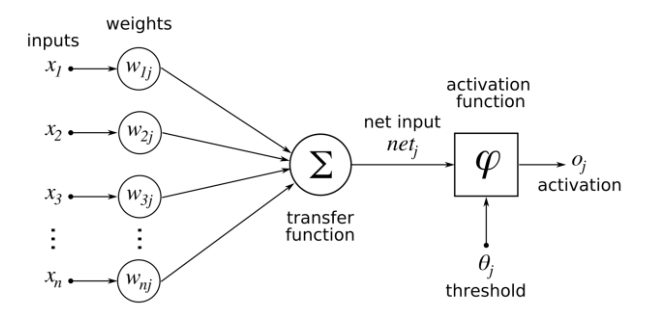

# ANN Visualizer — Forward Neural Network

An interactive, full-stack tool for building and running your own artificial neural network — from scratch, in real time.

Configure the topology, submit inputs, and watch activations propagate live through a canvas-rendered network.



---

## What it does

- **Custom neural network engine** — neurons, weighted connections, sigmoid activation, bias, and forward propagation all implemented manually in TypeScript (no ML libraries)
- **Live canvas renderer** — draws the network dynamically, colour-codes fired vs unfired neurons in real time
- **Full-stack architecture** — an Express.js backend receives inputs, runs the computation server-side, and returns results to the frontend
- **Interactive UI** — configure inputs and hidden layers, pick a preset, submit values, and watch the network light up
- **Preset scenarios** — XOR gate, multi-class classifier, deep network, and single-neuron examples to get started instantly

---

## Tech stack

| Layer | Technologies |
|---|---|
| Language | TypeScript, JavaScript (ES2020) |
| Backend | Node.js, Express.js |
| Frontend | HTML5 Canvas API, Vanilla JS |
| Styling | CSS custom properties, Montserrat + JetBrains Mono |
| Build | ts-node (no compilation step needed) |

---

## Getting started

### Prerequisites

- Node.js ≥ 18
- npm ≥ 9

### Installation

```bash
git clone https://github.com/paboyi/AI-Thesis---Forward-Neural-Network-Visualization.git
cd AI-Thesis---Forward-Neural-Network-Visualization
npm install
```

### Run

```bash
cd backend
npm start
```

Then open [http://localhost:3000](http://localhost:3000) in your browser. //outdated
open your index.html files as a live server. You should see a url like [http://127.0.0.1:5500/frontend/src/index.html]
The reason for this change is because the Frontend & Backend were put into 2 separate folders in order to host them both on Vercel & Render respectively. 

---

## How to use it

1. **Configure the network topology**
   - Set the number of input neurons (e.g. `3`)
   - Set the hidden layers as comma-separated neuron counts (e.g. `4, 3`)
   - Set the number of output neurons (e.g. `2`)
   - Or pick a **preset** to auto-fill a working configuration

2. **Click "Render Network"**  
   The canvas draws the network with all its connections.

3. **Submit input values**  
   Enter one number per input neuron, comma-separated. Values between `0` and `1` work best (they are the natural domain of the sigmoid function).

4. **Watch it run**  
   - 🟢 Green neurons **fired** (sigmoid output > 0.6)
   - 🔴 Red neurons **did not fire**
   - Numbers beside each neuron show the exact activation value

---

## How it works — the math

Each neuron computes:

```
z = (x₁·w₁) + (x₂·w₂) + ... + (xₙ·wₙ) + bias
output = sigmoid(z) = 1 / (1 + e^(-z))
```

Where:
- `x` = inputs from the previous layer
- `w` = randomly initialised weights (Xavier-style: uniform in `[-1, 1]`)
- `bias` = `0.25` (fixed)
- A neuron **fires** if `sigmoid(z) > 0.6`

Weights are re-initialised on every render — this visualizer demonstrates **forward propagation only**, not training.

---

## Project structure

```
src/
├── index.ts                          # Express server & API routes
├── index.html                        # UI
├── index.js                          # Canvas renderer & frontend logic
├── styles.css
├── img/
└── lib/
    └── neuronal-net/
        ├── activation-functions.ts   # Sigmoid activation + fired flag
        ├── neuron.ts                 # Single neuron — weighted sum, activation
        └── neuronal-net.ts          # Full network — builds layers, runs forward pass
```

---

## API

### `POST /run-network`

Runs a forward pass through the network.

**Request body:**

```json
{
  "input":        [0.5, 0.8, 0.2],
  "inputCount":   3,
  "hiddenLayers": [4, 3],
  "outputCount":  2
}
```

**Response:**

```json
{
  "finalOutputs":       [0.7431, 0.6812],
  "firedNeurons":       [[1, 0, 1, 0], [1, 1, 1]],
  "eachLayerInputValues": [
    [0.5, 0.8, 0.2],
    [0.7431, 0.512, 0.691, 0.48],
    [0.7431, 0.6812]
  ]
}
```

| Field | Description |
|---|---|
| `finalOutputs` | Sigmoid-activated output layer values |
| `firedNeurons` | Per-layer fired flags (`1` = fired), from hidden layer 1 onward |
| `eachLayerInputValues` | Activation values at every layer including inputs |

---

## Design decisions

**Why server-side computation?**  
The neural network runs on the Express backend rather than in the browser. This separates the ML engine (TypeScript classes) from the rendering logic, demonstrates a real client-server architecture, and makes the TypeScript engine easy to test independently.

**Why no ML library?**  
Every weight, activation, and propagation step is implemented from scratch. This is intentional — the project demonstrates understanding of the underlying math, not library usage.

**Why fixed weights (no training)?**  
This is a forward-propagation visualizer, not a trainer. Weights are randomised on each render to show how the same topology produces different activations depending on initialisation.

---

## Roadmap

- [ ] Weight display on connection lines (hover tooltip)
- [ ] Stepped propagation animation (layer by layer)
- [ ] ReLU and tanh activation functions
- [ ] Save / restore network configuration (JSON export)
- [ ] Training mode (backpropagation on simple datasets)

---

## Author
Philippa Aboyi

Built as an extension of my BSc AI thesis project.  
[GitHub](https://github.com/paboyi/AI-Thesis---Forward-Neural-Network-Visualization)
